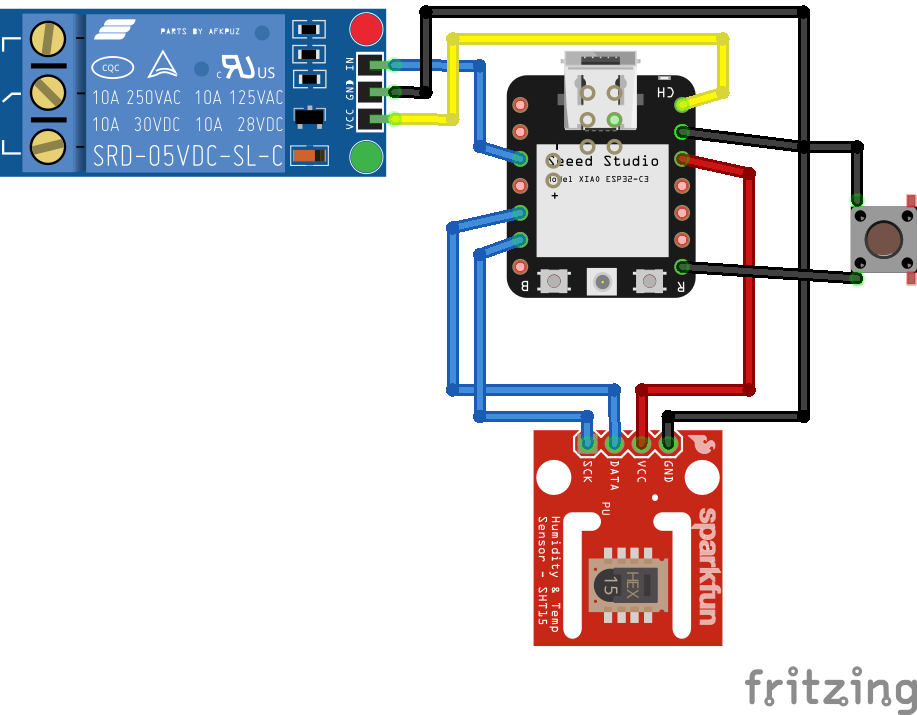

# Humidity Fan Control
## About
This project is using a *Seeed Studio XIAO ESP32C3* controller 
to observe the humidity with a *Sensirion SHT2x6* sensor.

The controller will observe the humidity in a room. 
If it's above a specified threshold after several cycles, a relay will 
be turned on (e.g. Fan). After humidity drops below the threshold, 
relay will be turned off immediately. 

